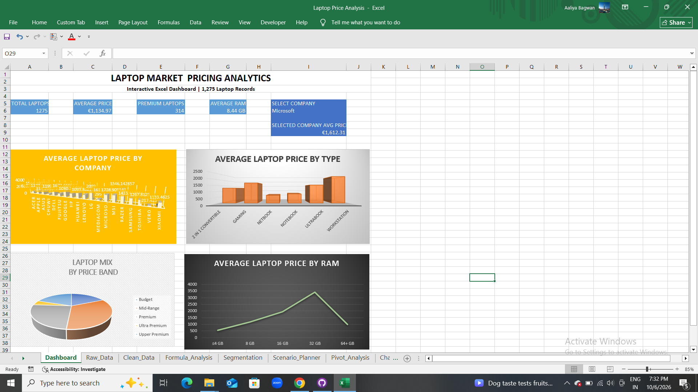

# Laptop Price Analysis — Advanced Excel

An end-to-end Excel data analysis project built on a 1,275-record laptop pricing dataset. The project demonstrates practical Excel skills used for data cleaning, analysis, lookup logic, interactive inputs, PivotTables, PivotCharts, and dashboard reporting.

## Project objective

Analyze laptop pricing and configuration patterns to answer business questions such as:

- Which laptop companies have higher average prices?
- Which laptop types are positioned at higher average prices?
- How is the dataset distributed across price bands?
- How does average price vary across RAM segments?
- How does a selected company's average price compare with the overall market benchmark?

## Skills demonstrated

- Power Query
- Custom Columns
- IF / AND / OR
- VLOOKUP
- Data Validation
- PivotTables
- PivotCharts
- Advanced Excel formulas
- Dashboard development
- KPI analysis
- Data cleaning and transformation

## Workbook structure

1. `Dashboard` — KPI cards, interactive company selector, VLOOKUP benchmark and four charts
2. `Raw_Data` — original laptop records
3. `Clean_Data` — cleaned dataset and derived analytical fields
4. `Formula_Analysis` — formula and lookup analysis
5. `Segmentation` — price-band and RAM-band summaries
6. `Scenario_Planner` — interactive benchmark analysis
7. `Pivot_Analysis` — PivotTable views
8. `Charts` — PivotCharts
9. `Power_Query` — documented Power Query workflow

## Dashboard

The dashboard includes:

- Total Laptops
- Average Price
- Premium Laptops
- Average RAM
- Company selection with Data Validation
- Selected Company Average Price using VLOOKUP
- Average Laptop Price by Company
- Average Laptop Price by Type
- Laptop Mix by Price Band
- Average Laptop Price by RAM



## Power Query workflow

The project uses Power Query to:

1. Import the laptop CSV
2. Promote the first row as headers
3. Set appropriate data types
4. Rename required columns
5. Create custom analytical columns
6. Load the cleaned result into Excel

## Key analytical fields

The cleaned dataset includes:

- `TotalStorage_GB`
- `ScreenResolution`
- `PriceBand`
- `WeightBand`
- `RAM_Band`
- `Display_Feature`

## Formula examples

### Price band

```excel
=IF(H3<500,"Budget",IF(AND(H3>=500,H3<1000),"Mid-Range",IF(AND(H3>=1000,H3<1500),"Premium",IF(AND(H3>=1500,H3<2500),"Upper Premium","Ultra Premium"))))
```

### Display feature

```excel
=IF(OR(L3="Yes",M3="Yes",N3="Yes"),"Enhanced Display","Standard Display")
```

### Company benchmark

```excel
=IFERROR(VLOOKUP(I6,Formula_Analysis!$H$2:$I$20,2,FALSE),"N/A")
```

### RAM segment average price

```excel
=AVERAGEIF(Clean_Data!$AB$2:$AB$1276,D4,Clean_Data!$H$2:$H$1276)
```

## Data and analytical limitations

This is an observational laptop dataset. Price differences across specifications are descriptive relationships and should not be interpreted as proof of causation.

The company selector and Scenario Planner use historical/category benchmarks. They are not future-price forecasting models.

The price-band and RAM-band definitions are project-specific analytical groupings, not official market standards.

## Portfolio positioning

This project is designed to demonstrate an end-to-end **Advanced Excel / Data Analyst** workflow:

**Raw CSV → Power Query → Clean Data → Excel Formulas → Data Validation → PivotTables → PivotCharts → Dashboard**

## Repository contents

- `data/laptop_prices.csv`
- `docs/data_dictionary.md`
- `docs/formula_map.md`
- `docs/power_query_workflow.md`
- `docs/pivot_and_charts.md`
- `docs/interview_story.md`
- `docs/project_structure.md`
- `screenshots/dashboard.png`
